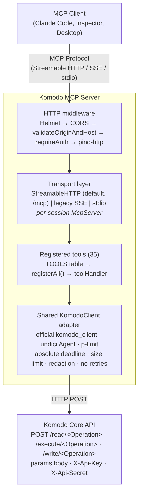
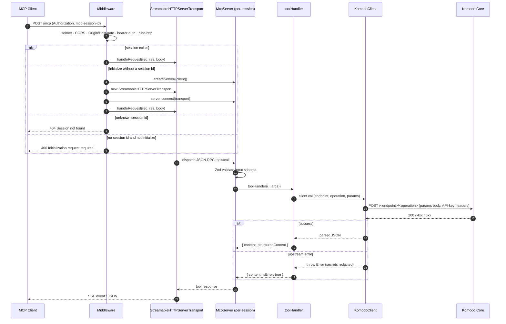

# Architecture

This document describes the system architecture and design of the Komodo MCP Server.

## System overview



## Sequence: a tool call



## Request flow

For a Streamable HTTP tool call:

1. Client `POST /mcp` with `Authorization: Bearer …` and `mcp-session-id` (on follow-up calls).
2. Helmet sets standard security headers; CORS handles `OPTIONS` preflight.
3. `validateOriginAndHost` rejects `Origin` or `Host` not in the allow-list (DNS-rebinding defense).
4. `requireAuth` constant-time compares the bearer token (or admits loopback if no token configured).
5. `pino-http` logs the request (with `Authorization`, `X-Api-Key`, `X-Api-Secret` redacted).
6. The streamable handler looks up the session. A known `mcp-session-id` dispatches to its `StreamableHTTPServerTransport`; an unknown ID returns 404. Without an ID, only a `POST` initialize request may create a fresh per-session `McpServer` and transport; every other request returns 400. CORS exposes `mcp-session-id` so browser clients can read it.
7. The MCP SDK validates the JSON-RPC message, runs the input through the tool's Zod schema, and invokes the handler.
8. The `toolHandler` wrapper calls `KomodoClient.call(endpoint, operation, params)`. On success it returns `formatResult(...)`; on throw it returns `{ isError: true }`.
9. `KomodoClient.call` enters the `p-limit` semaphore and delegates once to the official `komodo_client@2.1.1` method. The official client sends `POST /read/<Operation>`, `/write/<Operation>`, or `/execute/<Operation>` with the operation params as the body and API-key headers. The adapter never retries.
10. A process-wide Undici dispatcher reuses TCP connections, enforces one absolute request deadline and a response-size limit, and returns the parsed result. On error, secrets are redacted from the message before the error reaches the tool handler.

## File structure

```
src/
├── index.ts            # buildApp() factory, transports, middleware,
│                       # SIGTERM/SIGINT graceful shutdown
├── server.ts           # createServer({ client? }) — DI factory
├── komodo-client.ts    # Official-client adapter, pooling, bounds, redaction
└── tools/
    ├── registry.ts     # Declarative TOOLS table + registerAll()
    └── utils.ts        # formatResult, toolHandler
```

## Component responsibilities

### `src/index.ts`

- Reads + validates env vars (`MCP_PORT`, `MCP_TRANSPORT`, `MCP_BIND_HOST`, `MCP_AUTH_TOKEN`/`MCP_AUTH_TOKEN_FILE`, `MCP_ALLOWED_ORIGINS`, `MCP_ALLOWED_HOSTS`, `MCP_MAX_SESSIONS`, `MCP_SESSION_IDLE_TIMEOUT_MS`, `LOG_LEVEL`).
- Builds and configures Pino logger (writes to stderr — safe in stdio mode).
- Defines the security middleware (`constantTimeEqual`, `requireAuth`, `validateOriginAndHost`).
- `buildApp(options)` returns `{ app, closeAll }` for tests; `main()` only runs when invoked as a binary.
- Creates one shared Komodo adapter for all HTTP sessions while retaining a separate `McpServer` for each session.
- Wires streamable and legacy SSE transports with re-entry-safe cleanup and resettable idle timers (30 minutes by default).
- Installs a final 4-arg error middleware.
- Registers `SIGTERM`/`SIGINT` handlers that start the 15-second hard-shutdown timer before cleanup, stop accepting HTTP connections, close active sessions, and finally close the shared adapter.

### `src/server.ts`

- `createServer({ client? })` accepts an injected `KomodoClient` (DI-friendly for tests). Default constructs from env via `KomodoClient.fromEnv()`.
- Builds the SDK's `McpServer` and calls `registerAll(server, client)`.

### `src/komodo-client.ts`

- `KomodoClient.fromEnv()` validates `KOMODO_ADDRESS` as an `http(s)` URL, normalizes to origin, supports `*_FILE` env conventions for Docker secrets, and reads optional tuning (`KOMODO_TIMEOUT_MS`, `KOMODO_MAX_CONCURRENCY`, `KOMODO_MAX_RESPONSE_BYTES`).
- Stores `apiKey`/`apiSecret` in `#private` fields. `toJSON` and `Symbol.for("nodejs.util.inspect.custom")` return redacted forms.
- Exposes `call(endpoint, operation, params)` as a narrow adapter over the official `komodo_client@2.1.1` read/write/execute methods.
- Installs a process-wide Undici dispatcher backed by an `Agent`, and limits concurrent calls with `p-limit`.
- Enforces a 30-second absolute request deadline and a 16 MiB response-size limit by default. Calls are attempted exactly once; the adapter never retries.
- Restores the prior global dispatcher and closes its Agent when the shared adapter closes.

### `src/tools/registry.ts`

- `TOOLS: ToolSpec[]` describes all 35 tools (name, title, description, endpoint, operation, input shape, annotations, optional `buildParams`/`summary`).
- `READ_ONLY` / `IDEMPOTENT_WRITE` / `NON_IDEMPOTENT_WRITE` / `DESTRUCTIVE` annotation presets.
- `configRecord` schema rejects keys matching `^(api[_-]?key|api[_-]?secret|password|secret|webhook[_-]?secret|token)`.
- Bounded fragments: log `tail` int 1–5000 default 100; `terms` 1–20 entries each ≤256 chars; `compose_contents` ≤256 KiB.
- `registerAll(server, client)` iterates the table, wraps each handler in `toolHandler`, and calls `server.registerTool(...)`.

### `src/tools/utils.ts`

- `formatResult(result, summary)` — short text summary + `structuredContent`; large payloads (>64 KiB serialized) omit text inline.
- `toolHandler(fn, summary)` — try/catch wrapper that converts thrown errors into `{ isError: true }` MCP results.

## MCP client authentication

| Mode | Behavior |
|---|---|
| `MCP_AUTH_TOKEN` set | Bearer token required on `/mcp` and `/messages`. Compared via `crypto.timingSafeEqual` over SHA-256 digests (length-leak-resistant). |
| `MCP_AUTH_TOKEN` unset | Loopback callers admitted; non-loopback rejected with 401 and a hint about setting the token. |

`/health` is anonymous regardless.

The `Origin` allow-list (`MCP_ALLOWED_ORIGINS`) is enforced only when set and an `Origin` header is present (no `Origin` header = non-browser caller, allowed). The `Host` allow-list (`MCP_ALLOWED_HOSTS`, default `127.0.0.1,localhost`) is enforced unconditionally and is the primary DNS-rebinding defense.

## Session lifecycle

- Only a `POST /mcp` initialize request without `mcp-session-id` may create a streamable session. The SDK fires `onsessioninitialized(sid)`, at which point the session is registered in the `Map`. A supplied but unknown session ID returns 404; it never creates replacement state.
- Each session owns its own `McpServer`; tools/state are isolated. All HTTP sessions share the same Komodo adapter and connection pool.
- Streamable and legacy SSE sessions each have a resettable idle timer. Activity resets it; after `MCP_SESSION_IDLE_TIMEOUT_MS` (default `1800000`, or 30 minutes), the re-entry-safe cleanup removes and closes the session.
- `closeAll()` closes every session first, then closes the shared Komodo adapter and its Agent.

For legacy SSE (`MCP_TRANSPORT=sse`), the lifecycle is similar but split across `GET /sse` (open) and `POST /messages?sessionId=…` (subsequent messages).

## Reliability (Komodo adapter)

- 30-second absolute request deadline by default, covering headers and the complete response body.
- 16 MiB maximum response body by default (`KOMODO_MAX_RESPONSE_BYTES`).
- Eight concurrent upstream calls by default (`KOMODO_MAX_CONCURRENCY`), with TCP connection reuse through the shared Undici Agent.
- Exactly one official-client call per tool invocation. There is no retry option; failures propagate immediately so write and execute operations cannot be duplicated by adapter policy.
- Errors are normalized as `Komodo API <endpoint> (<operation>) request failed: <detail>`, with API key and secret values scrubbed from the detail.

## Authentication to Komodo Core

```
POST /read/ListServers HTTP/1.1
Content-Type: application/json
X-Api-Key: <KOMODO_API_KEY>
X-Api-Secret: <KOMODO_API_SECRET>

{}
```

The operation is encoded in the path and the request body is the params object; it is not a `{ type, params }` envelope. Headers are not logged (Pino redaction); secrets are retained only in the adapter's `#private` fields.

The official `komodo_client@2.1.1` package is GPL-3.0. Deployments that redistribute this server with production dependencies should complete a GPL-3.0 redistribution/compliance review; this architectural note does not change the repository's own license declaration.

## Error handling

1. **Input validation**: Zod schemas reject invalid inputs before the handler runs. The SDK surfaces these as JSON-RPC validation errors.
2. **Tool errors**: thrown exceptions are caught by `toolHandler` and returned as `{ isError: true }` so the MCP client gets a structured error rather than a transport failure.
3. **Upstream errors**: the adapter returns a normalized `Error` identifying the endpoint and operation, with secrets redacted.
4. **Express errors**: a final 4-arg middleware logs (Pino) and replies 500 if no response was sent.
5. **Transport errors**: SDK-level transport errors are surfaced via `transport.onerror`/Pino.
