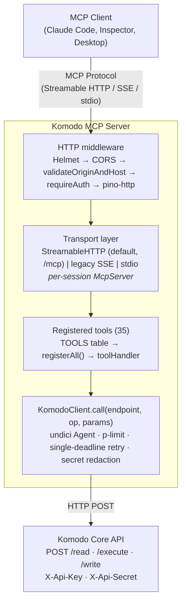
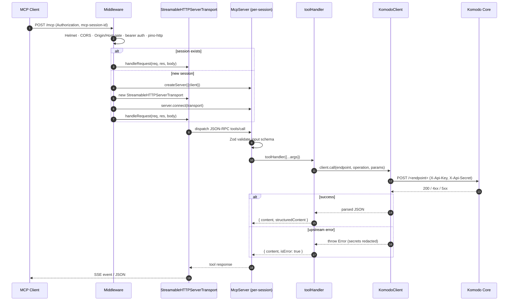

# Architecture

This document describes the system architecture and design of the Komodo MCP Server.

## System overview



## Sequence: a tool call



## Request flow

For a Streamable HTTP tool call:

1. Client `POST /mcp` with `Authorization: Bearer …` and `mcp-session-id` (on follow-up calls).
2. Helmet sets standard security headers; CORS handles `OPTIONS` preflight.
3. `validateOriginAndHost` rejects `Origin` or `Host` not in the allow-list (DNS-rebinding defense).
4. `requireAuth` constant-time compares the bearer token (or admits loopback if no token configured).
5. `pino-http` logs the request (with `Authorization`, `X-Api-Key`, `X-Api-Secret` redacted).
6. The streamable handler looks up the session: if found, dispatch to its `StreamableHTTPServerTransport.handleRequest`; otherwise instantiate a fresh `McpServer` (per-session) bound to a new transport, register all tools via `registerAll`, and dispatch.
7. The MCP SDK validates the JSON-RPC message, runs the input through the tool's Zod schema, and invokes the handler.
8. The `toolHandler` wrapper calls `KomodoClient.call(endpoint, operation, params)`. On success it returns `formatResult(...)`; on throw it returns `{ isError: true }`.
9. `KomodoClient.call` enters the p-limit semaphore, then `#request`: the call shares a single deadline across attempts, retries on 5xx/429/transient (read endpoint only) and on pre-send transport errors (any verb), with jittered exponential backoff. The undici Agent reuses TCP connections.
10. Response is parsed with a size guard (`maxResponseBytes`) and returned. On error, secrets are redacted from the message before the error reaches the tool handler.

## File structure

```
src/
├── index.ts            # buildApp() factory, transports, middleware,
│                       # SIGTERM/SIGINT graceful shutdown
├── server.ts           # createServer({ client? }) — DI factory
├── komodo-client.ts    # KomodoClient — HTTP, retry, redaction, secrets
└── tools/
    ├── registry.ts     # Declarative TOOLS table + registerAll()
    └── utils.ts        # formatResult, toolHandler
```

## Component responsibilities

### `src/index.ts`

- Reads + validates env vars (`MCP_PORT`, `MCP_TRANSPORT`, `MCP_BIND_HOST`, `MCP_AUTH_TOKEN`/`MCP_AUTH_TOKEN_FILE`, `MCP_ALLOWED_ORIGINS`, `MCP_ALLOWED_HOSTS`, `LOG_LEVEL`).
- Builds and configures Pino logger (writes to stderr — safe in stdio mode).
- Defines the security middleware (`constantTimeEqual`, `requireAuth`, `validateOriginAndHost`).
- `buildApp(options)` returns `{ app, closeAll }` for tests; `main()` only runs when invoked as a binary.
- Wires the streamable and legacy SSE transports with per-session `McpServer` instances and re-entry-safe cleanup.
- Installs a final 4-arg error middleware.
- Registers `SIGTERM`/`SIGINT` handlers that close the HTTP server, drain active sessions, and exit (15s hard cap).

### `src/server.ts`

- `createServer({ client? })` accepts an injected `KomodoClient` (DI-friendly for tests). Default constructs from env via `KomodoClient.fromEnv()`.
- Builds the SDK's `McpServer` and calls `registerAll(server, client)`.

### `src/komodo-client.ts`

- `KomodoClient.fromEnv()` validates `KOMODO_ADDRESS` as an `http(s)` URL, normalizes to origin, supports `*_FILE` env conventions for Docker secrets, and reads optional tuning (`KOMODO_TIMEOUT_MS`, `KOMODO_MAX_RETRIES`, `KOMODO_MAX_CONCURRENCY`).
- Stores `apiKey`/`apiSecret` in `#private` fields. `toJSON` and `Symbol.for("nodejs.util.inspect.custom")` return redacted forms.
- Exposes the generic `call(endpoint, operation, params)` plus thin wrappers for backward compatibility.
- Internally manages the shared `undici.Agent` and `p-limit` semaphore.
- Backoff: jittered exponential with a single deadline computed from `timeoutMs`. Read retry on 5xx/429/transient `TypeError`; pre-send transport errors (DNS, ECONNREFUSED, EAI_AGAIN, ECONNRESET-pre-headers, undici connect/socket errors) retry on any verb.
- `#parseBody` enforces `maxResponseBytes` (16 MiB default).

### `src/tools/registry.ts`

- `TOOLS: ToolSpec[]` describes all 35 tools (name, title, description, endpoint, operation, input shape, annotations, optional `buildParams`/`summary`).
- `READ_ONLY` / `IDEMPOTENT_WRITE` / `NON_IDEMPOTENT_WRITE` / `DESTRUCTIVE` annotation presets.
- `configRecord` schema rejects keys matching `^(api[_-]?key|api[_-]?secret|password|secret|webhook[_-]?secret|token)`.
- Bounded fragments: `tail` int 1–10000 default 100; `terms` 1–20 entries each ≤256 chars; `compose_contents` ≤256 KiB.
- `registerAll(server, client)` iterates the table, wraps each handler in `toolHandler`, and calls `server.registerTool(...)`.

### `src/tools/utils.ts`

- `formatResult(result, summary)` — short text summary + `structuredContent`; large payloads (>64 KiB serialized) omit text inline.
- `toolHandler(fn, summary)` — try/catch wrapper that converts thrown errors into `{ isError: true }` MCP results.

## MCP client authentication

| Mode | Behavior |
|---|---|
| `MCP_AUTH_TOKEN` set | Bearer token required on `/mcp` and `/messages`. Compared via `crypto.timingSafeEqual` over SHA-256 digests (length-leak-resistant). |
| `MCP_AUTH_TOKEN` unset | Loopback callers admitted; non-loopback rejected with 401 and a hint about setting the token. |

`/health` is anonymous regardless.

The `Origin` allow-list (`MCP_ALLOWED_ORIGINS`) is enforced only when set and an `Origin` header is present (no `Origin` header = non-browser caller, allowed). The `Host` allow-list (`MCP_ALLOWED_HOSTS`, default `127.0.0.1,localhost`) is enforced unconditionally and is the primary DNS-rebinding defense.

## Session lifecycle

- A new `/mcp` request without a known `mcp-session-id` triggers `createServer()`, instantiates a `StreamableHTTPServerTransport`, and connects them. The SDK fires `onsessioninitialized(sid)`, at which point we register the session in our `Map`. A re-entry-guarded `cleanup()` closure runs once via `transport.onclose`, `onsessionclosed`, or our `closeAll()` (called by the SIGTERM handler).
- Each session owns its own `McpServer`; tools/state are isolated.
- `closeAll()` iterates the maps and invokes `cleanup()` for each session.

For legacy SSE (`MCP_TRANSPORT=sse`), the lifecycle is similar but split across `GET /sse` (open) and `POST /messages?sessionId=…` (subsequent messages).

## Reliability (KomodoClient)

- 30 s default timeout; deadline shared across all retries (the timeout budget is *not* reset per attempt).
- 100 ms × 2^(n−1) backoff multiplied by uniform jitter ∈ [0.5, 1.5).
- Retries:
  - Read endpoint, status 5xx or 429 → retry up to `maxRetries` (default 2).
  - Read endpoint, transient `TypeError` (network error post-send) → retry.
  - Any endpoint, pre-send transport error (DNS/connect/EAI_AGAIN/UND_ERR_CONNECT_TIMEOUT/UND_ERR_SOCKET) → retry.
  - Otherwise → propagate.
- Errors are always normalized to `Error` instances with `Komodo API <endpoint> (<type>) returned <status>: <detail>` or `... request failed: <message>`. Secret values are scrubbed from `<detail>` and `<message>`.

## Authentication to Komodo Core

```
POST /read HTTP/1.1
Content-Type: application/json
X-Api-Key: <KOMODO_API_KEY>
X-Api-Secret: <KOMODO_API_SECRET>

{"type": "ListStacks", "params": {}}
```

Headers are not logged (Pino redaction); secrets retained only in the client's `#private` fields.

## Error handling

1. **Input validation**: Zod schemas reject invalid inputs before the handler runs. The SDK surfaces these as JSON-RPC validation errors.
2. **Tool errors**: thrown exceptions are caught by `toolHandler` and returned as `{ isError: true }` so the MCP client gets a structured error rather than a transport failure.
3. **Upstream errors**: `KomodoClient` returns a normalized `Error` whose `message` includes the Komodo HTTP status and detail, with secrets redacted.
4. **Express errors**: a final 4-arg middleware logs (Pino) and replies 500 if no response was sent.
5. **Transport errors**: SDK-level transport errors are surfaced via `transport.onerror`/Pino.
